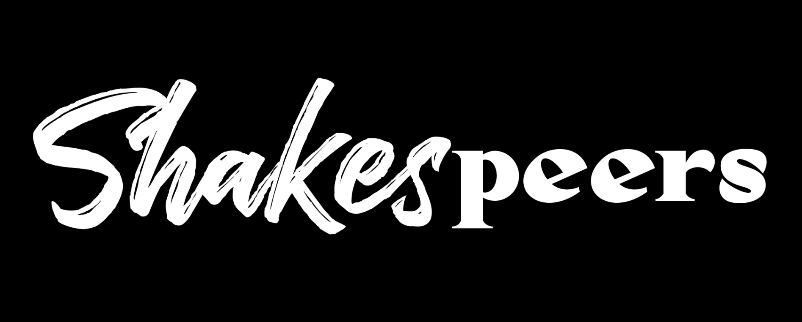

# Shakespeers

## User Story

*AS a student preparing for literature exams,
I WANT an app that helps me revise Shakespearean plays
SO that I can understand and remember key quotes more effectively.

## Links
Respository Link:
https://github.com/Giftyaning/Project-2  
Live Page Link: 
https://shakespeers.netlify.app

## Images

## Table of Contents
* [Installation](#installation)
* [Usage](#usage)
* [Licence](#licence)
* [Contributions](#contributions)

## Installation
N/A

## Usage

* Select a Shakespeare play from the dropdown list.
* Enter your name.
* A random quotation from your chosen play will be displayed.
* Fill in the 3 revision questions with your knowledge on the following areas, in relation to the quotation:

         Key contextual details

         Literary Features (within the randomly selected lines)

         Shakespeare's Authorial Intent
        
* By clicking on the 'help me' button for each of the above - a random generated fact will appear.
* Once completed you can save your answers as a PDF by selecting the 'Generate PDF' button.
* You can save your responces by selecting the 'Save responces' button. Saved responces will be saved on the left hand side of the screen. 
* Selecting the 'Next quote' button will generate a new quote.

## Contributions
Rory Simmonds

Luke Holliday

Kanika Aggarwal

Gifty Aning

Teannie Binns

## Licence

Copyright (c) [2024] [Shakespeers]

Permission is hereby granted, free of charge, to any person obtaining a copy
of this software and associated documentation files (the "Software"), to deal
in the Software without restriction, including without limitation the rights
to use, copy, modify, merge, publish, distribute, sublicense, and/or sell
copies of the Software, and to permit persons to whom the Software is
furnished to do so, subject to the following conditions:

The above copyright notice and this permission notice shall be included in all
copies or substantial portions of the Software.

THE SOFTWARE IS PROVIDED "AS IS", WITHOUT WARRANTY OF ANY KIND, EXPRESS OR
IMPLIED, INCLUDING BUT NOT LIMITED TO THE WARRANTIES OF MERCHANTABILITY,
FITNESS FOR A PARTICULAR PURPOSE AND NONINFRINGEMENT. IN NO EVENT SHALL THE
AUTHORS OR COPYRIGHT HOLDERS BE LIABLE FOR ANY CLAIM, DAMAGES OR OTHER
LIABILITY, WHETHER IN AN ACTION OF CONTRACT, TORT OR OTHERWISE, ARISING FROM,
OUT OF OR IN CONNECTION WITH THE SOFTWARE OR THE USE OR OTHER DEALINGS IN THE
SOFTWARE.

---
